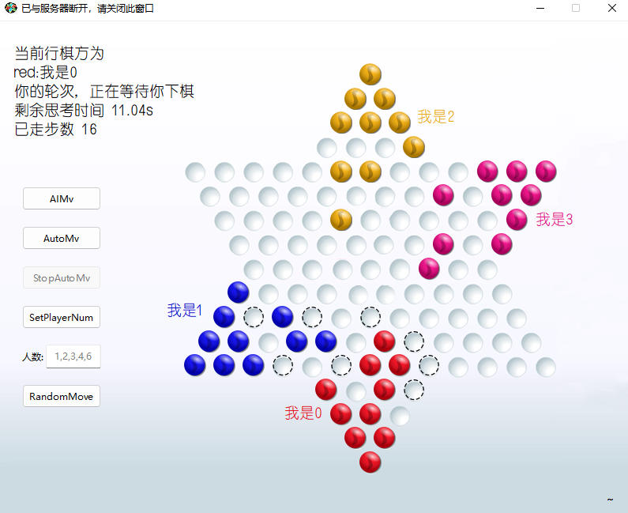
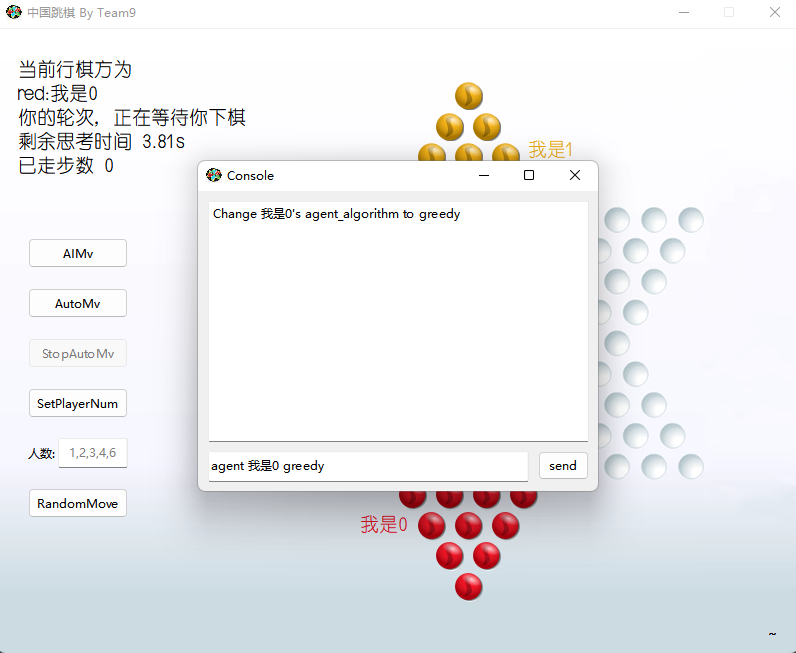

# 第九小组跳棋大作业实验报告
## 项目介绍
我们用 `Qt-C++` 设计并实现了一款带网络联机的交互良好的跳棋游戏。

项目的文档使用 `doxygen` 生成在：http://doc.panjd.net/

项目的演示视频在：https://www.bilibili.com/video/bv1dN4y1u7DL?vd_source=28602d173cf09845c54da253a564299c
## 总体设计与分工
<!-- 这边应该是粗略分工，然后具体分工罗列在开发日志那里 -->
## 模块设计
### 总体结构

蓝线代表派生关系，虚线代表所有关系
### 棋盘设计
#### 框架设计
总体上我们有3种棋盘，离线棋盘，客户端棋盘，服务端棋盘，后两者由前者继承。我们通过信号槽机制，统一了三种棋盘的信号发送和相应的棋盘处理，实现上表现在发送信号的时机，或者信号槽连接不同。

我们用同一张图演示了这种机制在客户端棋盘，服务端(棋盘)，离线中的体现

在结构上，显示窗口 `Widget` 拥有棋盘 `ChessBoard` 和重置棋盘按钮，棋盘拥有玩家 `Player`，控制台 `ConsoleWidget` 和 托管按钮，玩家拥有棋子 `Marble`。

这种结构具备高度的拓展性，如同一窗口显示多张棋盘，或适应不同的跳棋规则。
#### 游戏逻辑
- 初始化棋盘
  
    通过 `{玩家:方位}字典` 和 `本地玩家列表` ，我们统一地处理初始化

- 玩家轮换

    通过 `nextTurn` 函数，我们会在每次行棋(包括超时移走所有棋子这种行棋)后自动切换到下一个玩家。我们借此维护一个 `activatedPlayer` 来完成判断，和控制一个玩家是否有权利在这个回合移动它的棋子。

- 行棋和判断

    玩家在自己的行动轮下选择一个棋子 `selectedChess` 后，会通过 `BFS` 计算出所有的可行棋位置，并且在对应位置放上一个 `hint-marble` 也就是提示棋子，它具有特殊的造型和点击事件。

    玩家接着点击某一提示棋子后，就会将 `selectedChess` 顺着 `BFS` 时存储的路径移动到对应位置上。

    所以玩家没有机会发出非法的行棋请求。

- 超时

    `nextTurn` 函数会重置一个计时器，计时器的超时事件是发出超时信号。处理函数的功能是移出这个玩家的所有棋子，并标记该玩家在 `nextTurn` 时跳过，同时移入犯规者列表。

- 获胜与终局判断

    检查行棋玩家的棋子是否全部进入终点的区域，是则标记玩家，并移入胜利者列表。

    当超时或获胜后，会对两个列表的玩家数量加和，达到玩家数-1就会发出终局信号，并处理排行榜。

- 托管

    `nextTurn` 函数会适时发出本轮是本人行棋的信号。托管的开关即实时连接和断开信号和托管运算函数的连接。

    值得注意的是，我们在实现中使用了多线程，以提升交互体验，另外我们还设计了完善的锁和解锁机制，前者可以防止在托管计算过程玩家手动行棋，导致最终二次行棋，后者可以解除锁，并标记托管无效，在托管线程结束时不会执行行棋。

- 旋转棋盘和回放

    旋转棋盘只需要改变棋盘坐标和窗口坐标的映射关系即可，在中间加入一个旋转变换。

    回放我们只需要存储行棋路线，并拓展棋子的移动函数，加入一个自销毁机制即延迟调用析构函数即可。
#### 离线，客户端与服务端多态设计
客户端和服务端棋盘分别继承自离线棋盘，并用虚函数实现多态。

- 离线棋盘

    发出的信号和处理函数槽在同一个对象内连接。

- 客户端棋盘

    收到网络通讯后，通过网络处理函数去调用对应的处理函数。

- 服务端棋盘

    发出的信号不仅和处理函数槽自连接。同时外部的服务器也会将这个信号连接到广播函数上，实现广播功能。
#### 玩家类
玩家分为提示玩家和游戏玩家，其中提示玩家拥有提示棋子。通过提示玩家我们可以统一提示标志和正常棋子的控制方法。

玩家还拥有一个托管函数指针，可以借此修改托管的算法。同时玩家还存储起点，终点，姓名，上一次行棋路径等信息。

通过虚函数，玩家类还被派生出服务器玩家类（见下）

#### 控制台和托管
我们将正常游戏相关的功能通过按钮和编辑框的方式放置在游戏界面上。

将开发者功能，或高级功能放到了控制台里。

控制台可以实现例如上帝模式(使得每个位置都成为合法行棋位置)，切换AI算法，强制移动棋子等。
### 网络设计
#### 服务端设计
#### 客户端设计
### AI设计
### 其他设计
#### 返回主界面机制
子窗口打开后，我们会隐藏主窗口。为了实现关闭子窗口后回到主窗口的功能，我们在全局管理了各个窗口的指针。

#### 设置
我们用文件存储了设置信息，方便下次复用

## 游戏功能说明与展示
### 游戏功能
1. 有2,3,4,6个玩家的棋盘&重置棋盘
2. 可行棋位置提示

    
3. 行棋动画

    使用Qt动画库
4. 随机移动

5. AI托管

    单步 和 全程托管
    
    同时支持强制中断，放弃执行还未计算完成的托管

    支持切换算法，如控制台输入 `agent username greedy`
6. 控制台

   

7. 上帝模式

    控制台中输入 `god 1` 打开
8. 棋盘旋转
9.  行棋回放

    点击玩家姓名即可回放其上一步行棋
10. 超时判负
11. 终局判断

    这里展示因超时判负而决出胜负的场景
    
### 网络功能
1. 服务器/客户端房间连接与信息展示
2. 控制台
### AI说明

## 开发笔记
### 如何正确使用前向定义使用相互包含的类
为了模仿 `Qt` 绑定父对象的结构，我们也进行了类似的设计，结果出来了头文件需要相互包含的问题，解决方案如下。

在 `.h` 文件里，我们只进行最简单的定义，在 `.cpp` 文件里再 `#include<...>` 对应的头文件以使用类

### 为耗时任务设计多线程
耗时任务会阻塞线程，导致 UI 无法正常操作，所以我们学习并使用了多线程来分离耗时任务，这也是图形化界面常用的操作。

### socket 所有权转移
我们应该尽可能使用 `new` 的方法来生成对象方便移交所有权。我们在移交时会进行响应的信号槽断开，和连接新信号的操作。提高鲁棒性，避免如在游戏阶段误处理服务器错误发送的房间指令。

### 
## 开发日志
- 2022-03-11 停止内卷小组正式组建，新建文件夹 `ChineseCheckers`，开始学习 `Qt`。
---
- 2022-03-14 确定 `ChessBoard`，`Player`，`Marble` 的设计架构。设计部分素材。【潘俊达】
- 2022-03-15 实现棋子和背景的显示。【潘俊达】
- 2022-03-16 实现了行棋合法性判断。重构代码，解决类之间 `circular reference` 的问题。【潘俊达】
- 2022-03-17 实现选子、落子、提示棋子、玩家轮换、信息显示等操作。跳棋基本框架完成。【潘俊达】
- 2022-03-18 实现2/3/4/6玩家数，托管(随机移动)，棋子移动动画。【潘俊达】
- 2022-03-30 持续完善文档和注释，修复一些Bug。【潘俊达】
- 2022-04-09 设计棋子素材，完成棋子图片元素显示。【贾昊霖】
- 2022-04-15 增加了开始界面。【潘俊达】
- 2022-04-15 第一阶段完成。
---
<!-- 从第二阶段开始贾昊霖，程云飞的工作待填 -->
- 2022-05-02 调整了坐标参考系。为棋盘增加了基于坐标而非对象的棋子移动接口。【潘俊达】
- 2022-05-03 实现超时功能。【潘俊达】
- 2022-05-05 实现基于网络协议的棋盘初始化接口。【潘俊达】
- 2022-05-11 实现终局判断以及排名展示。【潘俊达】
- 2022-05-11 实现客户端棋盘接收并处理网络数据。【潘俊达】
- 2022-05-12 完善客户端网络交互逻辑，优化对局信息显示。【潘俊达】
- 2022-05-13 实现棋盘中游戏状态信号发送。对接服务端。【潘俊达】
- 2022-05-13 第二阶段完成。
---
- 2022-05-14 增加了 `AI` 接口。【潘俊达】
- 2022-05-21 增加了客户端控制台。实现了旋转视角，回放行棋。更新了时间戳机制。【潘俊达】
- 2022-06-26 分离并重构了服务端棋盘。【潘俊达】